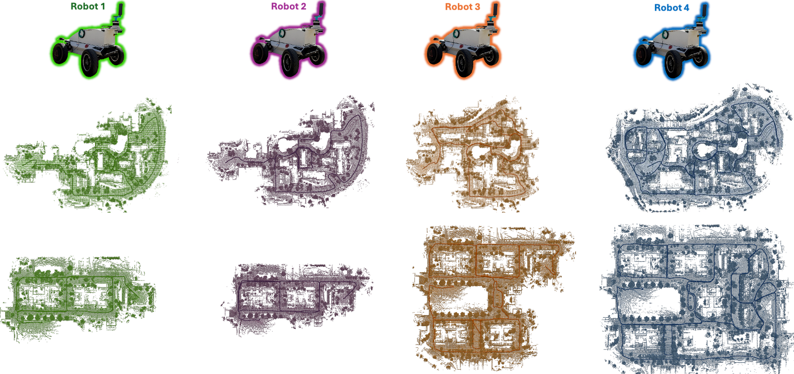

# The CU-Multi Dataset
<p align="center">
  
</p>

The CU-MULTI Dataset: A dataset aimed to support multi-robot map-merging, inter-robot place recognition and loop-closure detection.

# Author's Note
We provide the dataset download links, supplementary dataset information, and compressed directories containing *.csv* files of experimental results. The dataset tools and documentation will be released once finalized for *public* distribution, as their current form may compromise anonymity. 

## Download Dataset
**If you would like to download the dataset, you can do so [here](https://app.globus.org/file-manager?origin_id=ae3a873e-d159-4e7b-8a57-9be2699eea52&origin_path=%2F).** A Globus account is required, which you can create using either your institutional or personal email address.

# Dataset File Structure

```
CU-Multi/
├── calib/
│   └── description/
│       ├── meshes/
│       │   ├── cu_hunter_body.dae
│       │   └── cu_hunter_wheel.dae
│       └── robot.urdf
├── <environment>/
│   ├── <env>.osm.xml
│   └── <robot>/
│       ├── <robot>_gt_utm_poses.csv
│       ├── <robot>-<env>_cam_rgb/...
│       ├── <robot>-<env>_cam_depth/...
│       ├── <robot>-<env>_imu_gps/...
│       ├── <robot>-<env>_poses/...
│       └── <robot>-<env>_lidar/
│           ├── metadata.yaml
│           └── <robot>-<env>_lidar_0.db3
```

## ROS2 topics, message types, and associated sensors

| Topic Name                     | Message Type                          | Sensor | Publish Rate        | Description                     |
|--------------------------------|---------------------------------------|--------|-------------|--------------------------------------|
|***\<robot\>_\<env\>_ground_truth.db3***|                               |        |        | |
| &nbsp;&nbsp;&nbsp;&nbsp;&nbsp;&nbsp;`<robot>/ground_truth/path` | nav_msgs/msg/Path | - | -      | .                                    |
| &nbsp;&nbsp;&nbsp;&nbsp;&nbsp;&nbsp;`<robot>/ground_truth/odometry`| nav_msgs/msg/Odometry | - | 20 Hz  | . |
| &nbsp;&nbsp;&nbsp;&nbsp;&nbsp;&nbsp;`/tf` | tf2_msgs/msg/TFMessage | - | 20 Hz | Publishes tf from 'world' frame to robot lidar frame 'base_link' at each lidar timestamp.|
| **\<robot\>_\<env\>_lidar.db3**|                                       ||||
| &nbsp;&nbsp;&nbsp;&nbsp;&nbsp;&nbsp;`<robot>/ouster/metadata`      | std_msgs/msg/String | LiDAR  | -      | . |
| &nbsp;&nbsp;&nbsp;&nbsp;&nbsp;&nbsp;`<robot>/ouster/points`        | sensor_msgs/msg/PointCloud2 | LiDAR  | 20 Hz  | . |
| &nbsp;&nbsp;&nbsp;&nbsp;&nbsp;&nbsp;`<robot>/ouster/imu` | sensor_msgs/msg/Imu | LiDAR  | 100 Hz | . |
| **\<robot\>_\<env\>_imu_gps.db3**  |||||
| &nbsp;&nbsp;&nbsp;&nbsp;&nbsp;&nbsp;`<robot>/imu/mag` | sensor_msgs/msg/MagneticField | IMU | 500 Hz | . |
| &nbsp;&nbsp;&nbsp;&nbsp;&nbsp;&nbsp;`<robot>/imu/data` | sensor_msgs/msg/Imu | IMU | 500 Hz | Raw IMU measurements. |
| &nbsp;&nbsp;&nbsp;&nbsp;&nbsp;&nbsp;`<robot>/imu/pressure` | sensor_msgs/msg/FluidPressure | IMU | 500 Hz | Air pressure measurements. |
| &nbsp;&nbsp;&nbsp;&nbsp;&nbsp;&nbsp;`<robot>/gnss_1/llh_position` | sensor_msgs/msg/NavSatFix | GPS | 2 Hz | Rear left RTK GPS measurements. |
| &nbsp;&nbsp;&nbsp;&nbsp;&nbsp;&nbsp;`<robot>/gnss_2/llh_position` | sensor_msgs/msg/NavSatFix | GPS | 2 Hz | Rear right RTK GPS measurements. |
| **\<robot\>_\<env\>_camera_rgb.db3** |||||
| &nbsp;&nbsp;&nbsp;&nbsp;&nbsp;&nbsp;`<robot>/camera/color/camera_info` | sensor_msgs/msg/CameraInfo  RGB-D  | 10 Hz | Camera intrinsic/distortion parameters. |
| &nbsp;&nbsp;&nbsp;&nbsp;&nbsp;&nbsp;`<robot>/camera/color/image_raw`   | sensor_msgs/msg/Image              | RGB-D | 10 Hz | Images captured by front camera. |
| &nbsp;&nbsp;&nbsp;&nbsp;&nbsp;&nbsp;`<robot>/camera/color/metadata`    | realsense2_camera/msg/Metadata     | RGB-D | 10 Hz | ._ |
| **\<robot\>_\<env\>_camera_depth.db3** |||||
| &nbsp;&nbsp;&nbsp;&nbsp;&nbsp;&nbsp;`<robot>/camera/depth/camera_info` | sensor_msgs/msg/CameraInfo | RGB-D  | 10 Hz | Camera intrinsic/distortion parameters. |
| &nbsp;&nbsp;&nbsp;&nbsp;&nbsp;&nbsp;`<robot>/camera/depth/image_raw` | sensor_msgs/msg/Image  | RGB-D  | 10 Hz | Images captured by front camera. |
| &nbsp;&nbsp;&nbsp;&nbsp;&nbsp;&nbsp;`<robot>/camera/depth/metadata` | realsense2_camera/msg/Metadata | RGB-D | 10 Hz | ._ |

